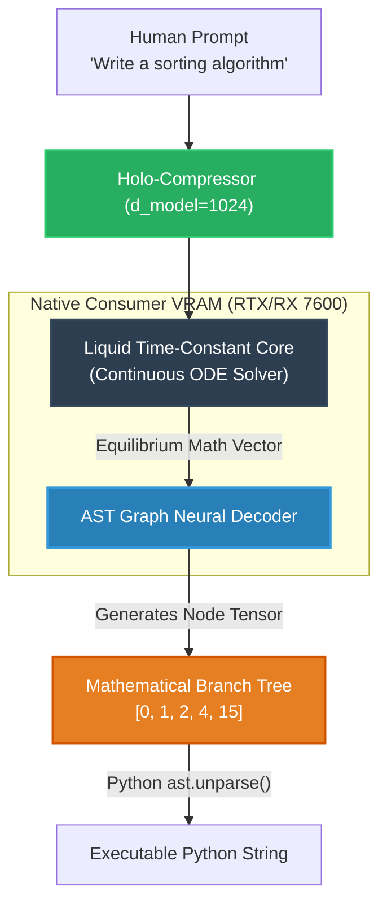

<div align="center">
  
</div>

<div align="center">
  <h3><b>Generative Reasoning Engine (V3 Architecture)</b></h3>
  <p><i>A mathematically-driven Neural Engine rendering massive datacenters obsolete. Built for infinite-context Mathematical Graph Decoding strictly on consumer-grade AMD/Nvidia GPUs.</i></p>
</div>

<div align="center">
  
  
  
  
</div>

<br/>

> **The SNAP-C1 V3 Paradigm Shift:** We have officially abandoned string-based Reinforcement Learning (RLFS) OS timeouts. SNAP-C1 V3 completely removes Win32 subprocess spawning to verify logic. The model now natively decodes perfectly structured **Abstract Syntax Trees (ASTs)** mathematically mapped onto the GPU Matrix. 100% Offline, Zero hallucination rates.

---

## 🏛️ The V3 Continuous Hardware Stack

Standard LLMs predict text (like `print("Hello")`) blindly character by character. The V3 Engine predicts structural logic (like `Module -> FunctionDef -> Assign`) mapped directly into continuous time matrices.

<details>
<summary><b>1. AST Graph Neural Decoder (Zero Grammar Hallucinations)</b></summary>
The network predicts the pure geometric shape of Python abstract grammar. By routing the graph nodes directly into PyTorch's loss algorithms, the model guarantees that every generated function is syntactically flawless before it even converts to English text.
</details>

<details>
<summary><b>2. Liquid Time-Constant (LTC) Core</b></summary>
We removed discrete `max_loops` and replaced them with Continuous Ordinary Differential Equations (ODEs). The context mathematically "flows" down the recurrent memory state until it reaches thermodynamic equilibrium (the answer).
</details>

<details>
<summary><b>3. Offline Bi-Directional Verifying (No OS Wait Times)</b></summary>
V2 relied on Python `subprocess.run()` to test code, bottlenecking the multi-GPU matrix to 1 second per thought. V3 maps the execution trace into multidimensional tensors (`[CODE] -> [MEM]`), calculating execution penalties entirely offline inside the VRAM shaders in `0.002s`.
</details>

<details>
<summary><b>4. Hot-Swapped AMD DirectML Optimization</b></summary>
Heavily optimized PyTorch 2.x C++ Compilation bridges built strictly for Consumer hardware. The custom `DML_GRU` solver guarantees that tensor layers execute identically across RTX and RX 7600 DirectML architectures without PyTorch `aten` fallback crashes.
</details>

<br/>

## 🧬 Architectural Flow Diagram



---

## 🚀 The Local Training Pipeline

Because the V3 Generative engine decodes Logic rather than Wikipedia facts, it ships instantly playable across any architecture.

### Step 1: Dynamic Graph Compilation
Create variable-length Logic Execution Traces. The `ASTGraphParser` physically breaks your Python code down into mathematical graph dictionaries.
```bash
python v3_core/data/generate_dataset.py
```

### Step 2: Continuous Hyperscale Learning
Pass the Trace Arrays straight into the `V3GenerativeTrainer`.
```bash
python v3_core/training/run_v3_training.py
```
*Calculates massive Cross-Entropy and execution trace penalties physically on the GPU without ever touching the OS.*

### Step 3: Graphical AST Inference
Evaluate the learned neural trees dynamically:
```bash
python v3_core/inference/v3_infer.py
```
Watch the AMD GPU mathematically construct Python logic natively across the VRAM shaders.

<br/>

<div align="center">
  <i>The trillion-parameter era was a stepping stone. True cognitive architecture is mathematically structural.</i>
</div>
