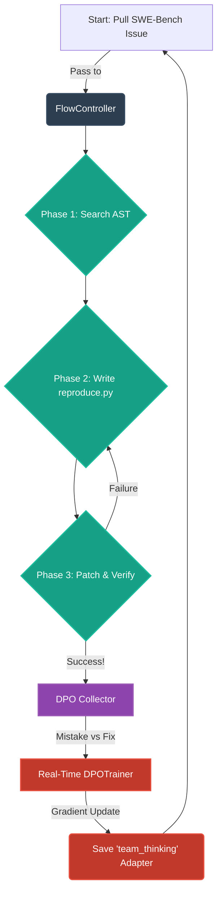
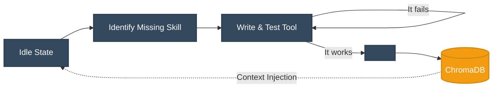

  <h1>🧠 SNAP-C1</h1>
  
<b>Self-Neural Adaptive Processing - Core 1</b>

  
<i>The first generation of AGI Models that can learn online, think like humans, learn from mistakes, and retrain their own data.</i>

---

## 🚀 Overview

**SNAP-C1** is an experimental open-source AI architecture designed to push small, local models (1B - 8B parameter class) towards Artificial General Intelligence (AGI). 

Instead of relying solely on static pre-trained weights, SNAP-C1 uses a **Mixture of LoRA Experts (MoLoRA)** combined with **Real-Time Failure-Contrastive DPO (Direct Preference Optimization)**. 

If the model makes a mistake, it builds a reproduction script, patches its own code, evaluates the patch, and instantly **fine-tunes its own neural weights in real-time** before moving to the next task.

## 🏗️ The AGI Architecture

The system is built on four core pillars:

### 1. MoLoRA (Mixture of LoRA) Pipeline
The base model dynamically Hot-Swaps its specialized "neural circuits" (LoRA adapters) at inference time without merging weights.
- `team_thinking`: A deliberative debate persona (Architect, Critic, Implementer).
- `tool_use`: Strict JSON syntax generation for shell and file execution.
- `self_correction`: Autonomous `<review> -> <fix>` logic.

### 2. The Real-Time Self-Evolution Loop (Infinite Loop)
How the model learns from its mistakes 24/7.

### 3. Flow Engineering
We force the model into a standard operating procedure (SOP). 
Instead of guessing where a bug is in 100,000 lines of code, the model is forced to write a standalone `reproduce.py` script. The bug is only considered "fixed" when the reproducer script transitions from throwing an exception to throwing "Success."

### 4. Open-Ended Curiosity Engine
When not actively solving tasks, SNAP-C1 is dropped into an isolated sandbox (`inference/curiosity_engine.py`). 
It identifies gaps in its knowledge, writes new Python tools (e.g., a web scraper), tests them, and explicitly commits them to a permanent vector database (ChromaDB), permanently expanding its action space.

## 💻 Tech Stack
- **Transformers / PEFT**: For the dynamic MoLoRA routing and 4-bit quantization.
- **TRL (Transformer Reinforcement Learning)**: For the Real-Time Direct Preference Optimization (`trl.DPOTrainer`).
- **ChromaDB**: For Episodic Memory, Semantic injection, and Tool saving.

## ⚠️ Hardware Requirements
- **VRAM**: Minimum 8GB (AMD RX 7600, RTX 4060, etc.)
- **Base Model (Brain Transplant)**: Highly recommended to use `Llama-3.1-8B-Instruct` or `Qwen2.5-7B-Instruct` as the base model for maximum reasoning capabilities during the continuous training loop.

---
*Developed under the guidance of advanced architectural planning.*
