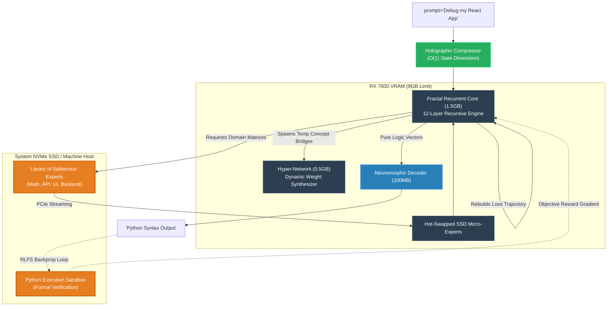

<div align="center">
  
</div>

<div align="center">
  <h3><b>Fractal Recurrent Core (V2 Architecture)</b></h3>
  <p><i>A mathematically-driven Neural Engine rendering massive datacenters obsolete. Built for infinite-context execution strictly on consumer-grade 8GB GPUs.</i></p>
</div>

<div align="center">
  
  
  
  
</div>

<br/>

> **The SNAP-C1 V2 Meta-Shift:** We are officially abandoning the feed-forward Transformer paradigm. SNAP-C1 V2 strips out the KV-Cache bloat and trades massive parameter counts for infinitely scalable **Iterative Latent Computation Loops.** It does not memorize human Wikipedia facts; it acts as a geometric Logic Engine.

---

## 🏛️ The Five Core Pillars of the FRC

Standard LLMs waste compute predicting syntax tags, parentheses, and pop-culture facts. The Fractal Recurrent Core splits the "brain" into hyper-efficient modules that memory-map precisely when needed, keeping active VRAM under `1.5GB`.

<details>
<summary><b>1. Holographic State Compression (Zero KV-Cache)</b></summary>
Standard attention crashes 8GB GPUs on long prompts because the KV-Cache forces the GPU to calculate relationships between every word ever seen. Our `HolographicCompressor` acts as an evolution of State Space Models (Mamba-2). It reads infinite context (like a 100,000-line codebase) sequentially and compresses its pure abstract meaning into a single `[32, 1024]` tensor. <b>O(1) Memory Complexity.</b>
</details>

<details>
<summary><b>2. The Fractal Recurrent Loop (Deep Thinking)</b></summary>
The V2 Core logic engine is mathematically tiny. Instead of 80 huge sequential layers predicting the next word, the `LatentRecurrentBlock` takes the Holographic tensor and recursively loops it <i>back through itself</i> in pure high-dimensional math. An internal `HaltGate` network observes the geometric entropy and only breaks the thought loop once >95% mathematical certainty is achieved.
</details>

<details>
<summary><b>3. SSD-Streamed Micro-MoE (Instant Knowledge Swaps)</b></summary>
Since 8GB cannot hold the Python documentation, we stripped domain knowledge out of the Core. Instead, `safetensor` Micro-Experts (50MB each) live on the system's NVMe SSD. The `DynamicRouter` predicts required logic domains, PCIe-streams the Micro-Experts directly into remaining VRAM, executes the math, and flushes them in ~50 milliseconds.
</details>

<details>
<summary><b>4. Hyper-Network Weight Synthesis</b></summary>
If the AI encounters a completely novel combination of coding frameworks, the `HyperNetwork` acts as a dynamic brain bridge. It intercepts the looping thought vector and synthesizes a brand-new, low-rank neural adapter <i>on-the-fly</i>, instantly generating new weights into VRAM to resolve Out-Of-Distribution (OOD) logic paths.
</details>

<details>
<summary><b>5. Neuromorphic Syntax Translation</b></summary>
100% of the FRC logic engine is spent on reasoning. It outputs pure abstract "Concept Vectors." A tiny, dedicated `ConceptDecoder` (100MB) sitting at the edge of the compute bus translates the geometry back into grammatical English or perfectly indented Python syntax.
</details>

<br/>

## 🧬 Architectural Flow Diagram



---

## 🚀 The Execution Pipeline

Because the V2 engine acts as a blank logic slate, it cannot be trained on Wikipedia scrapes. We use **Reinforcement Learning from Formal Systems (RLFS)**.

### Step 1: Algorithmic Pre-Training
We synthesized a massive abstract logic dataset (`generate_logic_dataset.py`) containing pure verifiable Math, Boolean Logic, and algorithmic Python traces.

Train the Hollow Core weights purely on this data using the **Google Colab Notebook (`FRC_Pretrain_Colab.ipynb`)** on a T4 GPU.

### Step 2: Reinforcement Learning from Formal Systems (RLFS)
Forget RLHF. True intelligence requires objective correctness.
1. Run `rlfs_trainer.py` on a multi-GPU compute node.
2. The model writes python algorithms.
3. The algorithms are passed to the `RLFSSandbox`.
4. If the code crashes, the sandbox strips the stack trace, converts it to an absolute reward penalty, and mathematically penalizes the exact layer orbits that caused the bug.

### Step 3: Local 8GB Inference Deployment
Once the weights are aligned through RLFS, deploy locally:
```bash
# Instantiates the logic pipeline on DirectML/Vulkan compatible GPUs
python v2_core/inference/frv2_inference.py
```

<br/>

<div align="center">
  <i>The trillion-parameter era was a stepping stone. True cognitive architecture is fractal.</i>
</div>
